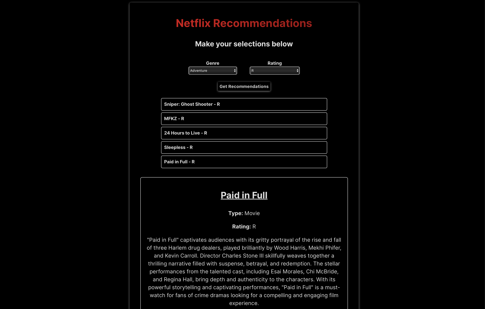

# Netflix Recommendations RAG Project

A prototype of an AI-powered recommendation system that uses Retrieval-Augmented Generation (RAG) techniques to recommend Netflix titles and generate dynamic descriptions using an LLM (e.g., OpenAI GPT). The system includes a FastAPI backend and a React frontend.



## Table of Contents

- [Project Overview](#project-overview)
- [Project Structure](#project-structure)
- [Setup & Installation](#setup--installation)
- [Running the Backend](#running-the-backend)
- [Running the Frontend](#running-the-frontend)
- [Usage](#usage)
- [RAG Workflow Explanation](#rag-workflow-explanation)
- [Future Improvements](#future-improvements)

## Project Overview

This prototype demonstrates how to build a recommendation system using a CSV dataset of Netflix titles. The system does the following:

- Retrieves Netflix titles based on user preferences (e.g., genre, rating, release year).
- Augments the original descriptions with a GPT model to produce short, marketing-style summaries.
- The final recommendations are then displayed on the React frontend, allowing users to interact with the recommended movies.

## Project Structure

Your project folder looks like this:

```
NetflixRecommendationSystem/
├── backend/
│   ├── data/
│   │   └── netflix_titles.csv
│   ├── venv/               
│   ├── app/
│   │   ├── pydantic_models.py
│   │   ├── routes/
│   │   │   └── recommend_routes.py
│   │   ├── services/
│   │   │   ├── rag_service.py
│   │   │   └── recommendation.py
│   │   └── __init__.py
│   ├── main.py
│   ├── requirements.txt
│   └── README.md           
├── frontend/
│   ├── src/
│   │   ├── App.js
│   │   ├── index.js
│   │   └── ...
│   ├── index.css
│   ├── package.json
│   └── ...
└── ...
```

### Key Directories & Files

- **backend/data/**: Contains the netflix_titles.csv file used as the knowledge base.
- **backend/app/routes/**: Holds FastAPI route: recommend_routes.py.
- **backend/app/services/**: Core logic for recommendation (recommendation.py) and GPT augmentation (rag_service.py).
- **backend/main.py**: Entry point for FastAPI.
- **backend/requirements.txt**: Python dependencies.
- **frontend/**: React application for the UI.

## Setup & Installation

### Clone the Repository
```bash
git clone <https://github.com/abkan2/Netflix-Recommendations>
cd NetflixRecommendationSystem
```

### Create a Virtual Environment
```bash
cd backend
python -m venv venv
source venv/bin/activate  # On macOS/Linux
venv\Scripts\activate     # On Windows
```

### Install Backend Dependencies
```bash
pip install -r requirements.txt
```

### Install Frontend Dependencies
```bash
cd ../frontend
npm install
```

## Running the Backend

### Navigate to the Backend Directory
```bash
cd ../backend
```

### Set Up Environment Variables
If you're using GPT for augmented descriptions, set your OpenAI API key. For example:
```bash
export OPENAI_API_KEY=<your-key>
```
or create a `.env` file (if you have a loader for environment variables).

### Run the FastAPI App
```bash
uvicorn main:app --reload
```
This should start the backend server at http://localhost:8000.

## Running the Frontend

### Navigate to the Frontend Directory
```bash
cd ../frontend
```

### Start the React App
```bash
npm run dev
```
This should start the frontend on http://localhost:3000.

## Usage

1. **Open the App**
   - Go to http://localhost:3000 in your browser.

2. **Make Your Selections**
   - Choose a genre (e.g., "Comedy").
   - Choose a rating (e.g., "TV-MA").
   - Optionally, provide a release year.

3. **Get Recommendations**
   - Click the "Get Recommendations" button. The frontend will send a POST request to the backend with your filters.

4. **View & Interact**
   - A list of recommended movies will appear.
   - Click on any recommendation to see its augmented description (generated via GPT).

## RAG Workflow Explanation

### Retrieve
- The system loads the Netflix CSV data into a Pandas DataFrame.
- When a user provides filters (genre, rating, release year), the backend filters the DataFrame to find matching titles.

### Augment
- For each recommended movie, the backend calls the OpenAI GPT API (or another LLM).
- GPT is provided with a prompt that includes the movie's title, director, cast, and original description.
- GPT returns a short, enticing summary that is appended to the movie's data.

### Response
- The backend sends these enriched movie entries back to the frontend as JSON.
- The frontend displays them in a list or table.
- The user can click a title to see its GPT-generated "augmented description."

